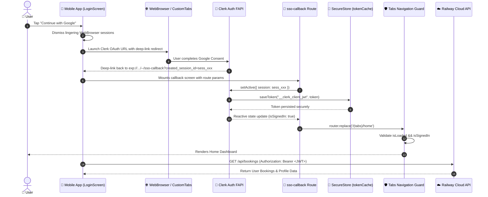
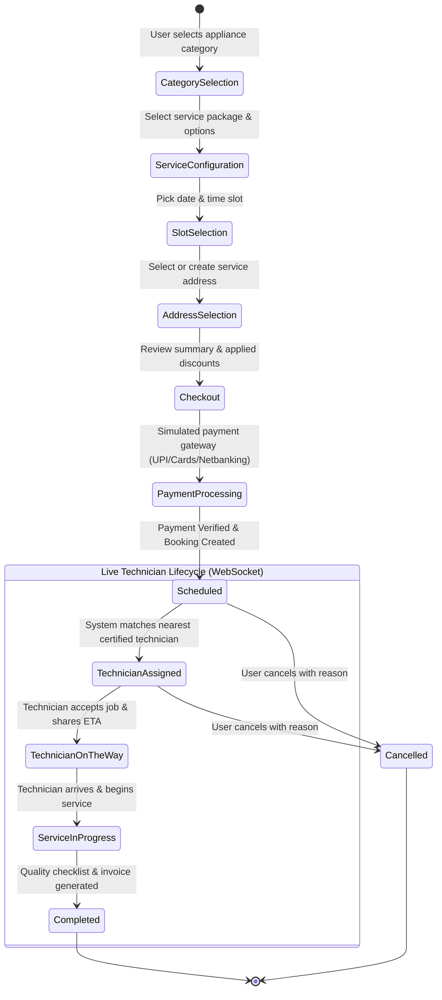

# Zevota 🛡️ — Appliance Protection & Home Care Platform

[](https://expo.dev)
[](https://reactnative.dev)
[](https://www.typescriptlang.org/)
[](https://clerk.com)
[](https://zevatoapp-production.up.railway.app/api/health)
[](https://www.prisma.io)

**Zevota** is an enterprise-grade mobile application and cloud backend designed for on-demand home appliance repair, maintenance, and extended protection plans. Built with **Expo SDK 55** (New Architecture / React Fabric) and a decoupled **Node.js/Express + Prisma** backend deployed on **Railway**.

---

## 🌐 Live Cloud Backend

The production API server is live on Railway and powering mobile app traffic:

| Resource | Endpoint | Description |
| :--- | :--- | :--- |
| **Live API Server** | [`https://zevatoapp-production.up.railway.app`](https://zevatoapp-production.up.railway.app/) | Root production service URL |
| **Health Check** | [`https://zevatoapp-production.up.railway.app/api/health`](https://zevatoapp-production.up.railway.app/api/health) | Uptime & latency health check |
| **REST API Base** | `https://zevatoapp-production.up.railway.app/api` | Services, bookings, payments, and user routes |
| **WebSocket Server** | `wss://zevatoapp-production.up.railway.app` | Real-time technician telemetry & status streaming |

---

## 🏛️ System Architecture

```mermaid
graph TD
    subgraph MobileClient ["📱 Mobile Client (Expo SDK 55 / React Native)"]
        UI["UI Layer<br/>(Expo Router + NativeTabs)"]
        AuthHooks["Auth Layer<br/>(Clerk SDK + useSSO)"]
        TokenCache["SecureStore<br/>(Native Keychain / Keystore)"]
        ApiClient["API Client<br/>(Axios / Fetch + Bearer Token)"]
        SocketClient["Socket.io Client<br/>(Real-time Booking Events)"]
        
        UI --> AuthHooks
        AuthHooks --> TokenCache
        UI --> ApiClient
        UI --> SocketClient
    end

    subgraph AuthCloud ["🔐 Authentication Provider"]
        Clerk["Clerk Auth Platform<br/>(OAuth 2.0 / JWT FAPI)"]
    end

    subgraph CloudBackend ["☁️ Production Backend (Railway)"]
        LB["Railway Edge & Load Balancer<br/>(HTTPS / WSS)"]
        Express["Express.js Server<br/>(Node.js + TypeScript)"]
        AuthMW["Auth Middleware<br/>(@clerk/backend JWT Verification)"]
        SocketServer["Socket.io WebSocket Server<br/>(Technician Telemetry)"]
        Prisma["Prisma ORM<br/>(Data Access Layer)"]
        DB[(Database<br/>SQLite / PostgreSQL)]
        
        LB --> Express
        LB --> SocketServer
        Express --> AuthMW
        AuthMW --> Prisma
        Express --> Prisma
        Prisma --> DB
    end

    AuthHooks <-->|OAuth / SSO Flow| Clerk
    ApiClient -->|REST API Requests (Bearer JWT)| LB
    SocketClient <-->|Live Updates & Notifications| SocketServer
```

---

## 🔐 Authentication & Session Lifecycle

The authentication pipeline integrates **Clerk** with native mobile deep-linking and biometric-ready encrypted credential persistence via `expo-secure-store`.



---

## 🔄 Booking & Service Execution Flow



---

## 📂 Repository Structure

```
Zevato_app/
├── app/                          # Expo Router file-based route definitions
│   ├── _layout.tsx               # Root application layout, ClerkProvider, push notifications
│   ├── index.tsx                 # Bootstrapping & auth redirect router
│   ├── sso-callback.tsx          # Deep-link OAuth redirect handler
│   ├── (auth)/                   # Authentication route group
│   │   ├── _layout.tsx           # Auth guard layout
│   │   ├── login.tsx             # Sign in with email & Google SSO
│   │   ├── register.tsx          # Sign up screen
│   │   └── complete-profile.tsx  # User profile onboarding completion
│   ├── (onboarding)/             # First-launch onboarding slider
│   └── (tabs)/                   # Core bottom tab navigation
│       ├── _layout.tsx           # Navigation tab bar configuration & auth guards
│       ├── home.tsx              # User dashboard & active booking widget
│       ├── explore.tsx           # Appliance repair catalog & categories
│       ├── bookings.tsx          # Historical and active bookings management
│       └── profile.tsx           # User settings, addresses, payment methods, logout
├── backend/                      # Decoupled REST & WebSocket backend service
│   ├── prisma/
│   │   ├── schema.prisma         # Relational database schema
│   │   └── seed.ts               # Database seed fixtures (services, categories, technicians)
│   ├── src/
│   │   ├── server.ts             # Express & Socket.io entry point
│   │   ├── db.ts                 # Prisma client instance
│   │   ├── middleware/
│   │   │   └── auth.ts           # Clerk JWT verification & atomic user upsert
│   │   └── routes/               # API route controllers
│   │       ├── catalog.ts        # Services, brands, products, and categories
│   │       ├── bookings.ts       # Booking lifecycle, status updates, cancellation
│   │       ├── payments.ts       # Payment simulation & invoice generation
│   │       └── users.ts          # Profile and address book management
│   ├── package.json              # Backend dependencies & scripts
│   └── tsconfig.json             # TypeScript configuration for Node.js
├── components/                   # Modular UI design system components
├── constants/                    # Design tokens (colors, typography, spacing, layout)
├── hooks/                        # Custom React hooks (useAuth, useTheme, etc.)
├── services/                     # Mobile API client layer (api.ts, bookings.ts, auth.ts)
├── types/                        # Shared TypeScript interfaces & models
├── utils/                        # Platform utilities (tokenCache.ts, formatting)
├── app.json                      # Expo application manifest & build configuration
└── package.json                  # Mobile application dependencies & scripts
```

---

## 🛠️ Technology Stack & Decisions

### Mobile Application
- **Runtime**: [Expo SDK 55](https://docs.expo.dev/versions/v55.0.0/) running on React Native 0.77.
- **Routing**: [Expo Router v5](https://docs.expo.dev/router/introduction/) with typed, file-based layouts.
- **Authentication**: [@clerk/expo](https://clerk.com/docs/references/expo/overview) utilizing native `expo-secure-store` token persistence (`AFTER_FIRST_UNLOCK`).
- **Styling**: Tailored design tokens with strict Apple Human Interface Guidelines (HIG) compliance, dark-mode ready tokens, and glassmorphism.

### Cloud Backend
- **Framework**: Express.js with TypeScript and `socket.io` for real-time technician telemetry.
- **Database & ORM**: SQLite (development) / PostgreSQL (production) with [Prisma ORM](https://www.prisma.io).
- **Deployment**: [Railway](https://railway.app) containerized platform with automatic TLS and zero-downtime deploys.

---

## 🚀 Getting Started

### Prerequisites
- Node.js `>= 20.x`
- npm `>= 10.x`
- Physical iOS or Android device with [Expo Go](https://expo.dev/go) (or Android Studio / Xcode Simulator)

### 1. Clone & Install

```bash
# Clone the repository
git clone https://github.com/your-org/Zevato_app.git
cd Zevato_app

# Install mobile dependencies
npm install

# Install backend dependencies
cd backend && npm install && cd ..
```

### 2. Environment Variables Setup

#### Mobile Client (`.env` in root):
```env
# Production Railway API endpoint (or LAN IP for local backend)
EXPO_PUBLIC_API_URL=https://zevatoapp-production.up.railway.app/api

# Clerk publishable key from dashboard.clerk.com
EXPO_PUBLIC_CLERK_PUBLISHABLE_KEY=pk_test_...
```

#### Backend (`backend/.env`):
```env
PORT=5001
DATABASE_URL="file:./dev.db"
CLERK_SECRET_KEY=sk_test_...
CLERK_PUBLISHABLE_KEY=pk_test_...
```

### 3. Running Locally

#### Terminal 1: Backend Server (Optional if using live Railway API)
```bash
cd backend
npx prisma generate
npx prisma db push
npm run dev
```

#### Terminal 2: Mobile App
```bash
npx expo start -c
```
- Scan the QR code using the **Expo Go** app on your phone.
- Press `a` to launch in Android Emulator or `i` for iOS Simulator.

---

## 🚢 Production Deployment (Railway)

The backend is configured for deployment on **Railway**:

1. **Root Directory**: Set to `/backend` in Railway service settings.
2. **Build Command**: `npm run build` (executes `prisma generate && tsc`).
3. **Start Command**: `npm run start` (executes `node dist/server.js`).
4. **Health Check**: `/api/health`.
5. **Networking**: Public HTTPS domain generated via Railway Networking settings.

---

## 👨‍💻 Engineering Best Practices

- **Zero Race Conditions in Auth**: Session state transitions use reactive `useEffect` hooks checking `isLoaded && isSignedIn` rather than static arbitrary timeouts.
- **Dynamic LAN/Cloud IP Resolution**: `services/api.ts` gracefully switches between cloud production URLs, dynamic Metro `hostUri` detection, and fallback routes.
- **Atomic Database Operations**: Backend authentication performs atomic user upserts, preventing concurrency errors during OAuth redirect callbacks.
- **Fail-safe Offline Caching**: The mobile client implements robust fallback caching for bookings and catalog data in case of intermittent network connectivity.
